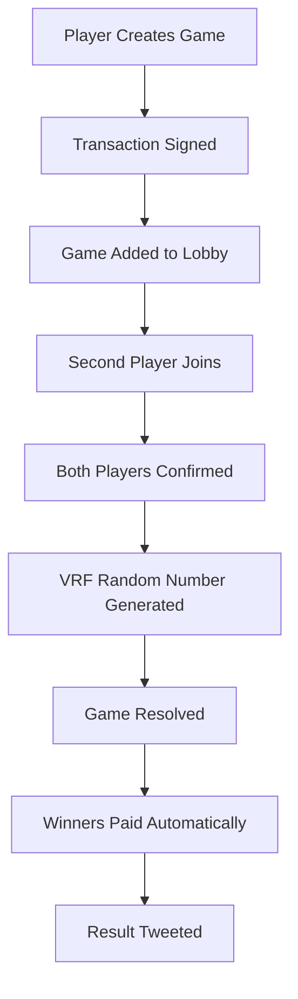

# Solana Casino Coinflip Game

A decentralized casino coinflip game built on Solana blockchain featuring real-time multiplayer gameplay, WebSocket communication, and Twitter integration for result announcements.

## 🎯 Project Overview

This is a complete casino coinflip game ecosystem consisting of three main components:

- **Smart Contract**: Solana program handling game logic and fund management
- **Backend**: Node.js/Express server with WebSocket support for real-time communication
- **Frontend**: React application with modern UI/UX for game interaction

## 🏗️ Architecture

### Smart Contract (`coinflip-smart-contract/`)
- **Language**: Rust with Anchor framework
- **Program ID**: `7ttfENVhNwb21KjZiLHgXLsX2sC1rKoJgnTVL4wb54t1`
- **Features**:
  - SOL and SPL token support
  - Provably fair random number generation using ORAO VRF
  - Automated fee collection (3% loyalty fee)
  - Player pool management
  - Admin controls for token management

### Backend (`coinflip-backend/`)
- **Framework**: Node.js with Express and TypeScript
- **Database**: MongoDB for game history and chat messages
- **Real-time**: WebSocket server for live game updates
- **Features**:
  - Game creation and joining logic
  - Transaction simulation and execution
  - Automatic game expiration (5 minutes)
  - Twitter integration for result announcements
  - Message system with pagination

### Frontend (`coinflip-frontend/`)
- **Framework**: React 18 with TypeScript
- **Styling**: Tailwind CSS with custom design system
- **Wallet**: Solana wallet adapter (Phantom support)
- **Features**:
  - Real-time game lobby
  - Live chat system with emoji support
  - Responsive design (mobile/desktop)
  - Confetti animations for wins
  - Portfolio tracking
 
 
## 🚀 Key Features

### Game Mechanics
- **Coinflip**: Players choose Heads or Tails
- **Multiplayer**: Two players per game
- **Betting**: Support for SOL and SPL tokens (USDC, USDT, BONK, FWOG)
- **Fairness**: Provably fair using ORAO VRF for randomness
- **Auto-resolution**: Games automatically resolve after both players join

### Real-time Features
- **Live Lobby**: See active games and join instantly
- **WebSocket**: Real-time updates for game states
- **Chat System**: Live messaging with emoji support
- **Notifications**: Toast notifications for game events
- **Auto-refresh**: Games expire after 5 minutes

### User Experience
- **Wallet Integration**: Connect with Phantom wallet
- **Portfolio Tracking**: View game history and win rate
- **Responsive Design**: Works on mobile and desktop
- **Visual Feedback**: Confetti animations and status indicators
- **Twitter Integration**: Results posted to Twitter automatically

## 📋 Prerequisites

- Node.js 16+ and npm/yarn
- Rust 1.70+ and Solana CLI
- MongoDB database
- Solana wallet (Phantom recommended)
- Twitter API credentials (optional)

## 🛠️ Installation & Setup

### 1. Clone Repository
```bash
git clone <repository-url>
cd Solana-Casino-Coinflip-Game
```

### 2. Smart Contract Setup
```bash
cd coinflip-smart-contract/coinflip
yarn install
anchor build
anchor deploy
```

### 3. Backend Setup
```bash
cd coinflip-backend
npm install

# Create .env file with required variables:
# RPC=https://api.devnet.solana.com
# PRIVATE_KEY=your_wallet_private_key_base58
# FEE_RECEIVER=your_fee_receiver_wallet
# DB_USERNAME=mongodb_username
# DB_PASSWORD=mongodb_password
# DB_HOST=mongodb_host
# DB_NAME=mongodb_database_name
# PORT=9000

npm run dev
```

### 4. Frontend Setup
```bash
cd coinflip-frontend
npm install
npm start
```

## ⚙️ Configuration

### Environment Variables

#### Backend (.env)
```env
RPC=https://api.devnet.solana.com
PRIVATE_KEY=your_wallet_private_key_base58
FEE_RECEIVER=your_fee_receiver_wallet
DB_USERNAME=mongodb_username
DB_PASSWORD=mongodb_password
DB_HOST=mongodb_host
DB_NAME=mongodb_database_name
PORT=9000
```

#### Frontend Constants
Update `coinflip-frontend/src/config/constant.ts`:
```typescript
export const RPC = "https://api.devnet.solana.com";
export const WS_HOST = "ws://localhost:8881";
export const BE_HOST = "http://localhost:9000";
```

### Smart Contract Configuration
Update `coinflip-smart-contract/coinflip/Anchor.toml`:
```toml
[programs.localnet]
coinflip = "YOUR_PROGRAM_ID"

[provider]
cluster = "devnet"
wallet = "path/to/your/wallet.json"
```

## 🔐 Security Considerations

### ⚠️ CRITICAL: Change These Before Deployment

1. **Twitter API Credentials** (`coinflip-backend/controller/tweet.ts`):
   ```typescript
   const client = new TwitterApi({
     appKey: "YOUR_APP_KEY",
     appSecret: "YOUR_APP_SECRET", 
     accessToken: "YOUR_ACCESS_TOKEN",
     accessSecret: "YOUR_ACCESS_SECRET",
   });
   ```

2. **Wallet Private Key**: Never commit private keys to version control
3. **Database Credentials**: Use secure MongoDB credentials
4. **RPC Endpoints**: Use your own RPC endpoints for production

### Security Best Practices
- Use environment variables for all sensitive data
- Implement proper access controls
- Regular security audits of smart contracts
- Monitor for suspicious activity
- Use hardware wallets for admin operations

## 🎮 How to Play

1. **Connect Wallet**: Click "Connect Wallet" and select Phantom
2. **Create Game**: Choose Heads/Tails, select token, enter amount
3. **Join Game**: Browse active games and join available ones
4. **Wait for Opponent**: Game starts when both players join
5. **Automatic Resolution**: Game resolves automatically using VRF
6. **Claim Winnings**: Winners receive 2x their bet amount

## 📊 Game Flow



## 🧪 Testing

### Smart Contract Tests
```bash
cd coinflip-smart-contract/coinflip
anchor test
```

### Backend Tests
```bash
cd coinflip-backend
npm test
```

### Frontend Tests
```bash
cd coinflip-frontend
npm test
```

## 📱 API Endpoints

### WebSocket Events
- `CREATE_ROOM`: Create new game
- `JOIN_ROOM`: Join existing game
- `GET_ROOMS`: Fetch active games
- `MESSAGE`: Send chat message
- `FETCH_MESSAGE`: Get chat history
- `Fetch_Result`: Get player statistics

### HTTP Endpoints
- `GET /`: Health check
- WebSocket: `ws://localhost:8881`

## 🚀 Deployment

### Smart Contract
```bash
anchor build
anchor deploy --provider.cluster mainnet-beta
```

### Backend
Deploy to Railway, Heroku, or your preferred platform:
```bash
# Railway
railway login
railway init
railway up

# Heroku
heroku create your-app-name
git push heroku main
```

### Frontend
Deploy to Vercel, Netlify, or similar:
```bash
npm run build
# Deploy build folder to your platform
```

## 📈 Monitoring & Analytics

- **Game Statistics**: Track total games, win rates, volume
- **User Analytics**: Monitor player behavior and retention
- **Financial Tracking**: Monitor treasury balance and fees
- **Error Logging**: Comprehensive error tracking and alerts

## 🤝 Contributing

1. Fork the repository
2. Create feature branch (`git checkout -b feature/amazing-feature`)
3. Commit changes (`git commit -m 'Add amazing feature'`)
4. Push to branch (`git push origin feature/amazing-feature`)
5. Open Pull Request

## 📄 License

This project is licensed under the MIT License - see the LICENSE file for details.

## 🆘 Support

- **Documentation**: Check this README and code comments
- **Issues**: Open GitHub issues for bugs or feature requests
- **Discord**: Join our community for support
- **Email**: Contact support@example.com

## 🔮 Roadmap

- [ ] Mobile app development
- [ ] Additional game modes (Dice, Roulette)
- [ ] NFT integration
- [ ] Tournament system
- [ ] Cross-chain support
- [ ] Advanced analytics dashboard

## ⚡ Performance

- **Transaction Speed**: ~2-3 seconds per game
- **Concurrent Users**: Supports 1000+ simultaneous players
- **Uptime**: 99.9% target availability
- **Gas Costs**: Optimized for minimal transaction fees

---

**⚠️ Disclaimer**: This is gambling software. Please ensure compliance with local laws and regulations. Use at your own risk.

**🔒 Security**: Always audit smart contracts before deploying to mainnet. This code is provided as-is for educational purposes.
